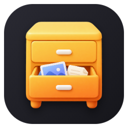
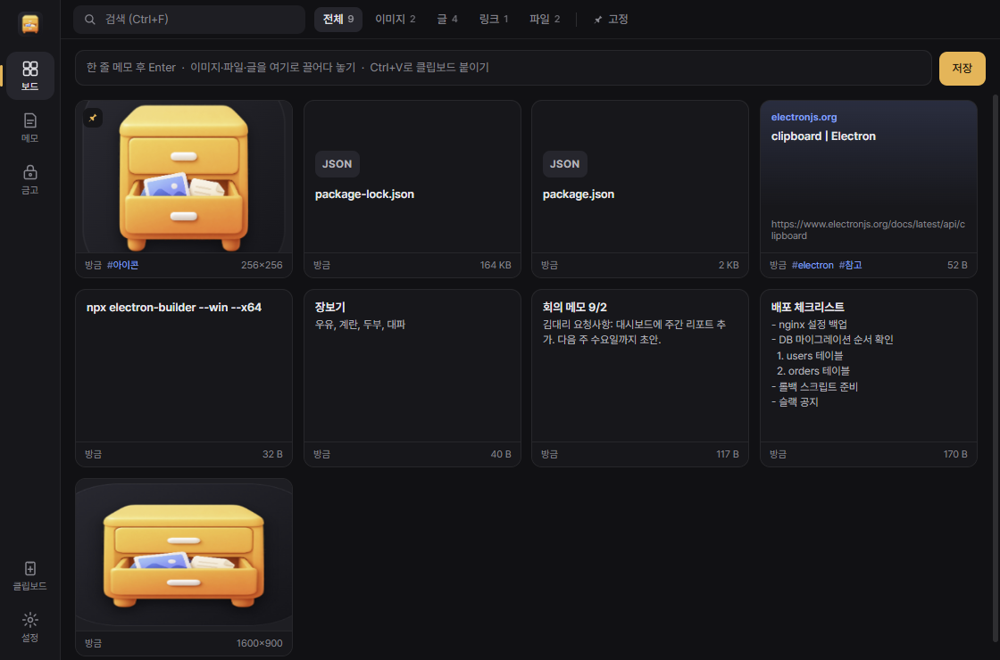

<div align="center">



<h1>서랍 (Seorap)</h1>

<p><strong>복사한 걸 잠깐 넣어두는 Windows 트레이 앱</strong></p>

<p>스크린샷, 텍스트, 링크, 파일, 비밀번호. 슬랙 "나에게 보내기"로 보내던 것들을 여기에 둡니다.</p>

<p>
  <a href="https://github.com/bbjbc/seorap/releases">다운로드</a> |
  <a href="#quickstart">Quickstart</a> |
  <a href="#단축키">단축키</a> |
  <a href="#금고-보안">금고 보안</a> |
  <a href="README.md">English</a>
</p>

[](https://github.com/bbjbc/seorap/releases)
[](https://github.com/bbjbc/seorap/actions/workflows/ci.yml)
[](https://github.com/bbjbc/seorap/releases)
[](LICENSE)
[](#quickstart)

⭐ _잘 쓰고 있다면 스타 하나 부탁합니다._

</div>

## About

스크린샷은 슬랙에 나에게 보내고, 메모는 메모장 탭으로 쌓아두고, 비밀번호는 어딘가 적어두는 식으로 쓰다가 만든 앱입니다. 이 세 가지를 트레이에 떠 있는 창 하나에서 처리합니다. 서버나 계정은 없고, 데이터는 전부 내 PC 폴더에 파일로 저장됩니다.


<sub>데모는 [termcast](https://termcast.xyz)로 만든 애니메이션 SVG입니다. 원본 테이프: [docs/demo/seorap.tape](docs/demo/seorap.tape)</sub>

- `Ctrl+Alt+V`: 어느 앱에서든 클립보드 내용(이미지, 텍스트, 링크, 파일)을 저장합니다. 창은 뜨지 않고 우하단에 알림만 표시됩니다.
- 보드: 카드를 클릭하면 클립보드에 복사되고, 다른 앱으로 드래그하면 파일로 들어갑니다.
- 메모: 저장 버튼이 없습니다. 입력을 멈추면 저장되고, `Ctrl+K`로 본문을 검색해 바로 열 수 있습니다. `Ctrl+F`는 열린 메모 안에서 찾고, 리스트는 끌어서 순서를 바꿀 수 있습니다.
- 금고: 마스터 비밀번호로 잠급니다. scrypt + AES-256-GCM, 자동 잠금, 복사한 비밀번호는 30초 후 클립보드에서 삭제됩니다.
- 같은 내용은 해시로 걸러 한 번만 저장하고, 삭제는 6초 안에 되돌릴 수 있습니다. 오래된 항목 자동 정리 옵션도 있습니다.
- 한국어·영어 UI (설정 > 일반). 새 버전이 나오면 왼쪽 레일에 조용히 버튼 하나만 뜹니다.
- Electron 44 + React 19 + TypeScript(strict), electron-vite로 번들. 런타임 npm 의존성은 번들에 들어가는 React와 Zustand뿐입니다.



## Quickstart

**1. 설치**

PowerShell에서 아래 한 줄을 실행하면 최신 릴리즈를 내려받아 SHA256을 확인하고 사용자 폴더에 설치한 뒤 실행합니다. 관리자 권한은 필요 없습니다.

```powershell
irm https://raw.githubusercontent.com/bbjbc/seorap/main/install.ps1 | iex
```

직접 내려받으려면 [Releases](https://github.com/bbjbc/seorap/releases)에서 고르면 됩니다.

```
Seorap-Setup-x.y.z.exe       설치형. 시작 메뉴 바로가기, Windows 시작 시 자동 실행 옵션
Seorap-x.y.z-portable.exe    설치 없이 실행
```

코드 서명이 없어서 처음 실행할 때 SmartScreen 경고가 나올 수 있습니다. "추가 정보" > "실행"으로 진행하면 됩니다. 릴리즈에 있는 `SHA256SUMS.txt`로 파일을 검증할 수 있습니다.

**2. 넣기**

앱은 트레이에 상주합니다. 무언가 복사한 다음:

```
Ctrl + Alt + V        클립보드 내용 저장. 알림만 뜨고 창은 그대로
Ctrl + Alt + Space    창 열기 / 닫기
```

창이 열려 있으면 파일이나 이미지를 끌어다 놓거나, `Ctrl+V`를 누르거나, 상단 입력창에 한 줄 적고 `Enter`를 눌러도 됩니다.

**3. 꺼내기**

```
카드 클릭             클립보드로 복사
카드 드래그           슬랙, 탐색기, 메일 창에 파일로 드롭
더블클릭              이미지는 크게 보기, 텍스트는 메모 편집기, 링크는 브라우저
```

**4. 메모와 금고**

```
Ctrl + 2   →  Ctrl + N        새 메모. 입력하면 자동 저장
Ctrl + K                       메모 본문 검색 후 바로 열기
Ctrl + 3                       금고. 처음에 마스터 비밀번호를 만듭니다 (분실 시 복구 불가)
```

---

## 세 가지 공간

| 공간 | 내용 | 주요 동작 |
|---|---|---|
| **보드** | 이미지, 텍스트, 링크, 파일을 카드 격자로 표시. 검색, 타입 필터, 태그, 고정 | 클릭 = 복사, 드래그 = 파일 드롭, `Delete` = 삭제(되돌리기 가능) |
| **메모** | 메모장 대체. 탭 대신 최근 수정 순 목록, 저장 버튼 대신 자동 저장. `.txt` 파일을 드롭하면 메모로 가져옴 | `Ctrl+N` 새 메모, `Ctrl+K` 빠른 찾기 |
| **금고** | 비밀번호, API 키, 인증서 비밀번호. 항목 전체를 암호화해서 저장하며 잠긴 상태에서는 이름도 보이지 않음 | "복사" 후 30초 뒤 클립보드 삭제, 5분 미사용 시 잠금 |

다른 화면은 [docs/screenshots](docs/screenshots)에 있습니다.

## 단축키

| 키 | 동작 | 범위 |
|---|---|---|
| `Ctrl+Alt+Space` | 창 열기 / 닫기 | 전역 |
| `Ctrl+Alt+V` | 클립보드 내용 저장 | 전역 |
| `Ctrl+Alt+N` | 새 메모 | 전역 |
| `Ctrl+1` `Ctrl+2` `Ctrl+3` | 보드 / 메모 / 금고 | 앱 |
| `Ctrl+K` | 빠른 찾기 | 앱 |
| `Ctrl+N` | 새 메모 (메모 모드) | 앱 |
| `Ctrl+V` | 클립보드 붙여 저장 (보드) | 앱 |
| `Ctrl+F` | 검색 | 앱 |
| `Ctrl+,` | 설정 | 앱 |
| `Delete` | 선택한 카드 삭제 | 보드 |
| `Esc` | 창 숨기기 | 앱 |

전역 단축키 3개는 설정에서 변경할 수 있습니다.

---

### 데이터

```
%APPDATA%\seorap\
├── settings.json
└── data\
    ├── index.json      항목 목록과 메타데이터
    ├── items\          원본 (png, txt, pdf ...)
    ├── thumbs\         썸네일 (최대 400px)
    └── vault.json      금고 (암호문만 저장)
```

원본은 일반 파일이라 개수 제한이 없고 탐색기에서 바로 열 수 있습니다. 격자는 썸네일만 사용하고 화면에 보이는 카드만 렌더링하므로 항목이 수천 개여도 느려지지 않습니다. 설정 > 저장 공간에서 폴더를 다른 드라이브나 OneDrive 안으로 옮길 수 있습니다. 여러 PC에서 동시에 사용하면 `index.json`이 덮어써질 수 있으므로 동시 사용은 아직 지원하지 않습니다.

> **네트워크**: 링크 제목을 가져올 때, 브라우저에서 끌어온 이미지를 내려받을 때, 그리고 6시간마다 GitHub Releases에서 최신 버전 번호를 확인할 때(설정 > 업데이트에서 끌 수 있음)만 통신합니다. 사용 데이터 수집은 없고, 저장한 항목을 외부로 보내지 않습니다.

---

### 금고 보안

| | |
|---|---|
| **키 유도** | scrypt (N = 2^16, r = 8, p = 1), 16바이트 랜덤 salt |
| **암호화** | AES-256-GCM, 항목마다 랜덤 96비트 nonce, 인증 태그 검증 |
| **저장 형태** | 이름, 아이디, 비밀번호, 메모를 하나의 암호문으로 저장. 잠긴 상태에서는 이름도 보이지 않음 |
| **키 보관** | 디스크에 쓰지 않음. 잠기면 메모리의 키를 0으로 덮어씀 |
| **자동 잠금** | 5분 미사용(설정 가능), 창 숨김, PC 잠금 및 절전 시 |
| **무차별 대입** | 실패할수록 대기 시간 증가, 최대 30초 |
| **클립보드** | 복사한 비밀번호는 30초 뒤 삭제, 자동 수집 대상에서 제외 |
| **화면** | 금고가 열려 있는 동안 창 캡처와 화면 공유 차단 (Windows API) |

PC에 키로거나 악성코드가 있으면 어떤 비밀번호 관리자도 안전하지 않습니다. 마스터 비밀번호가 약하면 암호화 자체가 의미가 없으므로 생성 시 길이와 조합을 검사합니다. 마스터 비밀번호를 잊으면 복구할 수 없습니다. 은행이나 메일 같은 주요 계정은 전용 비밀번호 관리자를 쓰고, 서랍 금고는 그 외의 비밀 정보 보관용으로 쓰는 것을 권장합니다.

---

### 개발

Node.js 22가 필요합니다.

```bash
git clone https://github.com/bbjbc/seorap.git
cd seorap
npm install
npm start          # electron-vite 로 빌드한 뒤 실행
npm run dev        # 렌더러 핫 리로드 개발 서버
npm run check      # 타입 검사 + Biome + ESLint (any 금지)
npm run format     # Biome 로 포맷
npm test           # 단위 테스트(Vitest) + 기능 테스트(Electron 실행)
npm run build      # dist/ 에 설치형 + 포터블 exe
npm run icons      # assets/icon.svg → icon.png / icon.ico
```

Electron 44 + React 19 + TypeScript(strict), [electron-vite](https://electron-vite.org)로 빌드합니다. 포맷·import 정렬·타입이 필요 없는 린트는 [Biome](https://biomejs.dev)가 맡고, ESLint에는 `any`와 처리하지 않은 프로미스를 막는 타입 인지 규칙과 React Compiler 규칙만 남겼습니다. 공유 타입은 전역 `Seorap` 네임스페이스([`src/shared/types.d.ts`](src/shared/types.d.ts))에 있고, IPC는 채널 이름 → 인자, 결과 타입 맵으로 정의되어 있어 메인과 preload가 어긋나면 컴파일 에러가 납니다. 렌더러는 상태를 작은 Zustand 스토어에, 부수 효과를 기능별 `actions.ts`에, 화면을 화살표 함수 컴포넌트에 둡니다. 메인 프로세스는 바뀌지 않았습니다.

```
src/shared/             types.d.ts(항목, 설정, IPC 채널, API), locales.ts(한/영 문자열)
src/main/               main.ts(창, 트레이, 단축키, IPC), store.ts, vault.ts, clipboard.ts, settings.ts
src/preload/            index.ts(메인 창의 window.scrap), toast.ts(알림 창)
src/renderer/           React 앱
  app/                  셸, 부팅 순서, IPC 구독, 전역 단축키, 드롭 처리, 디버그 훅
  stores/               Zustand 스토어: items, settings, ui, board, notes, vault
  features/             board, notes, vault, settings, detail, switcher, prompt, overlays, nudge, update
  components/           공용 표현 조각 (아이콘, Modal, SearchBox, TagList, SegControl, RichText)
  lib/                  api, i18n 훅, 포맷 함수, DOM 핸들
  styles/               영역별로 나눈 전역 CSS
  toast/                우하단 알림 창 (일반 TS)
scripts/                테스트, 아이콘, 캡처 도구 (main 과 함께 번들)
out/                    electron-vite 산출물 (커밋하지 않음)
```

릴리즈: `package.json` 버전을 올리고 같은 번호의 태그를 푸시하면 GitHub Actions가 빌드해서 Release에 exe 두 개와 체크섬을 올립니다.

```bash
npm version 0.4.0 --no-git-tag-version
git commit -am "release: v0.4.0"
git tag v0.4.0 && git push origin main v0.4.0
```

---

### 더 보기

[**스크린샷**](docs/screenshots/): 보드, 메모, 금고, 설정 화면. 영어 UI는 [docs/screenshots/en/](docs/screenshots/en/).

**로드맵**: 여러 PC 동시 사용을 위한 동기화 안전형 저장 구조, Windows 메모장의 저장하지 않은 탭 가져오기, 앱 잠금, 라이트 테마.

[**기여**](https://github.com/bbjbc/seorap/issues): 이슈와 PR 환영합니다. 큰 변경은 이슈에서 먼저 논의해 주세요. 커밋 전에 `npm run check`와 `npm test`를 실행해 주세요.

[**글꼴**](assets/fonts/): UI에 [Pretendard](https://github.com/orioncactus/pretendard)를 내장합니다 (SIL Open Font License 1.1).

---

<p align="center">
  <a href="https://github.com/bbjbc/seorap/releases"><strong>Releases</strong></a> | MIT
</p>
